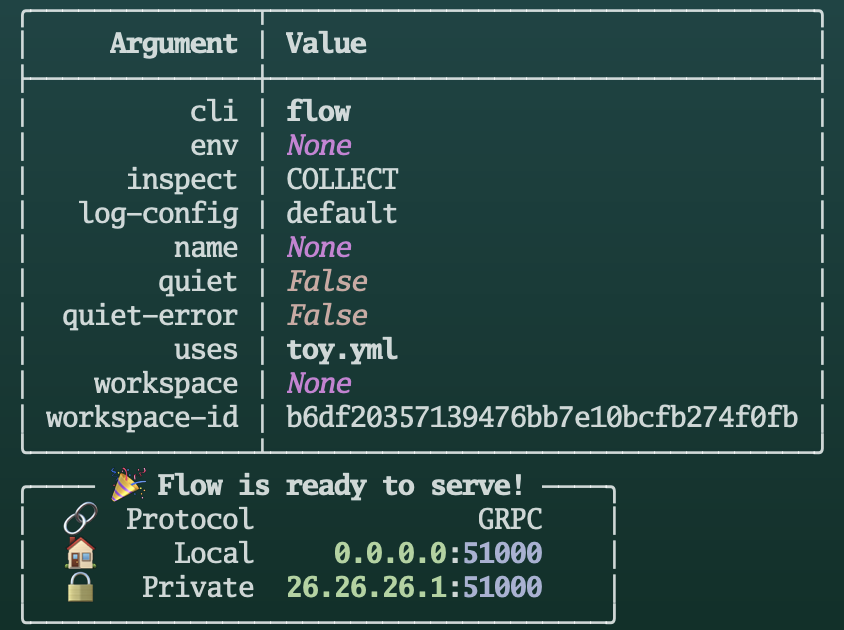

# Jina

## 1. Jina 是什么

简单来说 Jina 可以帮助你快速把非结构化数据例如图像，文档视频等，转换为向量数据。并结合 Jina 的其他组件设计，帮助你快速的把向量数据利用起来，实现多模态的数据搜索。

## 2. Jina 的三个基本概念

Document、Executor 和 Flow 是 Jina 的三个基本概念。

- Document 是基本的数据类型，它的作用就是可以将非结构化数据与向量数据之间进行映射，具体细节会在 DocArray 一章中详细阐述。
- Executor 可以理解为一个 Python 类，代表了 Jina 中的算法单元，比如把图像编码成向量、对结果进行排序等算法等都可以用 Executor 来表述。
- Flow 可以将多个 Executor 连接起来，将他们协调成流水线(pipeline)。

## 3. 安装 Jina

**安装 Jina 需要 Python3.7 及以上版本**

```python
# via pypi
pip install jina

# via conda
conda install jina -c conda-forge

# via docker
docker pull jinaai/jina:latest
```

## 4. 快速上手

我们通过下面的例子来理解 Jina 的基本概念，首先我们需要定义一个 YAML 文件，用于指定 Flow 按照什么逻辑执行

```YAML
# toy.yml
jtype: Flow
with:
  port: 51000
  protocol: grpc
executors:
- uses: FooExecutor
  name: foo
  py_modules:
    - test.py
- uses: BarExecutor
  name: bar
  py_modules:
    - test.py
```

定义好 YAML 文件后我们来定义具体的执行逻辑

```python
# 创建 test.py 文件与 YAML 文件在同一目录下
# 导入 document、executor 和 flow 以及 requests 装饰器
from jina import DocumentArray, Executor, requests, Document

# 编写 FooExecutor 与 BarExecutor 类，类中定义了函数 foo 和 bar
# 该函数从网络请求接收 DocumentArray (先暂时不需要理解它是什么)，并在其内容后面附加 "foo was here" 与 "bar was here"
class FooExecutor(Executor):
    @requests # 用于指定路由，类似网页访问 /index 和 /login 会被路由到不同的方法上是用样的概念，关于 request 下面会再进行详细介绍
    def foo(self, docs: DocumentArray, **kwargs):
        docs.append(Document(text='foo was here'))


class BarExecutor(Executor):
    @requests
    def bar(self, docs: DocumentArray, **kwargs):
        docs.append(Document(text='bar was here'))
```

运行以下命令启动 grpc 服务：

```shell
jina flow --uses toy.yml
```

启动成功后，可以看到如下输出结果



然后创建 `client.py` 文件，执行 `python client.py`

```python
# 从 Jina 中导入连接的客户端与 Document
from jina import Client, Document

c = Client(host='grpc://0.0.0.0:51000')  # 如果运行提示失败，可尝试使用localhost
result = c.post('/', Document()) # 将一个空的 Document 传到服务端执行
print(result.texts) 
```

最终会打印出一个 `"['', 'foo was here', 'bar was here']"` 字符串。

## 5. DocArray

### 5.1 定义

DocArray 是用于存储非结构化数据的数据结构工具包，是本次我们做跨模态应用的基础。通过这个小而精的入口，能友好地带你走进多模态、跨模态的世界。

DocArray 的亮点在于 Hierarchy + Nested。DocArray 有不同的层级结构，分层存储，第一层可以是一个整体的视频，第二层是该视频的不同镜头，第三层可以是镜头的某一帧。也可以是其他模态，比如第四层存储台词段落，第五层存储 ..... 既可以通过某个画面的描述搜索，也可以通过台词的意思去搜索，这样搜索的颗粒度，结构的多样性和结果的丰富度，都比传统文本检索好很多。

此外，DocArray 的设计对于 Python 用户来说非常直观，不需要学习新的语法。它融合了 Json、Pandas、Numpy、Protobuf 的优点，更适用于数据科学家和深度学习工程师。

### 5.2 三个基本概念

DocArray 由三个简单的概念组成：

- Document：一种表示嵌套非结构化数据的数据结构，是 DocArray 的基本数据类型。无论是处理文本、图像、视频、音频、3D、表格 或它们的嵌套或组合，都可以用 Document 来表示，从而使得各类数据的结构都非常规整，方便后续处理
- DocumentArray：用于高效访问、处理和理解多个文档的容器，可以保存多个 Document 的列表
- Dataclass：用于直观表示多模式数据的高级API

### 5.3 安装

3.x 版本的 Jina 已经包含了 DocArray，如果你用的是 3.x 的 Jina，可以跳过此步骤。如果你不清楚自己安装的版本号，可以在命令行里输入`jina -vf`来查看 Jina版本。

由于本项目涉及的是视频搜索剪辑，所以这里重点介绍**文本、图像和视频**在 Jina 中是如何处理的。

## 6. 文本处理

### 6.1 创建文本

```python
from jina import Document  # 导包

# 创建简单的文本数据
d = Document(text='hello, world.') 
print(d.text)  # 通过text获取文本数据
# 如果文本数据很大，或者自URI，可以先定义URI，然后将文本加载到文档中
d = Document(uri='https://www.w3.org/History/19921103-hypertext/hypertext/README.html')
d.load_uri_to_text()
print(d.text)
# 支持多语言
d = Document(text='👋	नमस्ते दुनिया!	你好世界！こんにちは世界！	Привет мир!')
print(d.text)
```

### 6.2 切割文本

```python
from jina import Document  # 导包

d = Document(text='👋	नमस्ते दुनिया!	你好世界！こんにちは世界！	Привет мир!')
d.chunks.extend([Document(text=c) for c in d.text.split('!')])  # 按'!'分割
d.summary()
```

### 6.3 text、ndarray 互转

```python
from jina import DocumentArray, Document  # 导包

# DocumentArray 相当于一个 list，用于存放 Document
da = DocumentArray([Document(text='hello world'), 
                    Document(text='goodbye world'),
                    Document(text='hello goodbye')])

vocab = da.get_vocabulary()  # 输出：{'hello': 2, 'world': 3, 'goodbye': 4}

# 转为ndarray
for d in da:
    d.convert_text_to_tensor(vocab, max_length=10)  # 转为tensor向量，max_length为向量最大值，可不设置
    print(d.tensor) 
   
 # 输出结果：
 [0 0 0 0 0 0 0 0 2 3] #用这种方式简单将字符串转为向量
 [0 0 0 0 0 0 0 0 4 3]
 [0 0 0 0 0 0 0 0 2 4]
 
 # ndarray
 for d in da:
    d.convert_tensor_to_text(vocab)
    print(d.text)

# 输出结果：
hello world
goodbye world
hello goodbye
```

### 6.4 Demo: 简单的文本匹配

```python
from jina import Document, DocumentArray

d = Document(uri='https://www.gutenberg.org/files/1342/1342-0.txt').load_uri_to_text() # 链接是傲慢与偏见的电子书，此处将电子书内容加载到 Document 中
da = DocumentArray(Document(text=s.strip()) for s in d.text.split('\n') if s.strip()) # 按照换行进行分割字符串
da.apply(lambda d: d.embed_feature_hashing())

q = (
    Document(text='she entered the room') # 要匹配的文本
    .embed_feature_hashing()  # 通过 hash 方法进行特征编码
    .match(da, limit=5, exclude_self=True, metric='jaccard', use_scipy=True) # 找到五个与输入的文本最相似的句子
)

print(q.matches[:, ('text', 'scores__jaccard')]) # 输出对应的文本与 jaccard 相似性分数

# 输出结果：
[['staircase, than she entered the breakfast-room, and congratulated', 
'of the room.', 
'She entered the room with an air more than usually ungracious,', 
'entered the breakfast-room, where Mrs. Bennet was alone, than she', 
'those in the room.'], 
[{'value': 0.6, 'ref_id': 'f47f7448709811ec960a1e008a366d49'}, 
{'value': 0.6666666666666666, 'ref_id': 'f47f7448709811ec960a1e008a366d49'}, 
{'value': 0.6666666666666666, 'ref_id': 'f47f7448709811ec960a1e008a366d49'}, 
{'value': 0.6666666666666666, 'ref_id': 'f47f7448709811ec960a1e008a366d49'}, 
{'value': 0.7142857142857143, 'ref_id': 'f47f7448709811ec960a1e008a366d49'}]]
```

## 7. 图像处理

图像部分需要提前安装 Pillow 和 matplotlib 包。首先以下图为例，进行图像部分的介绍：


### 7.1 读取图片并转为 tensor

```python
d = Document(uri='apple.png')
d.load_uri_to_image_tensor()

print(d.tensor, d.tensor.shape)
```

### 7.2 进行简单的图像处理

```python
from jina import Document

d = (
    Document(uri='apple.png')
    .load_uri_to_image_tensor()
    .set_image_tensor_shape(shape=(224, 224))  # 设置shape
    .set_image_tensor_normalization()  # 标准化
    .set_image_tensor_channel_axis(-1, 0)  # 更改通道
)

print(d.tensor, d.tensor.shape)

# 你可以使用 save_image_tensor_to_file 将 tensor 转为图像。当然，因为做了预处理，图片返回时损失了很多信息。
d.save_image_tensor_to_file('apple-proc.png', channel_axis=0)  # 因为前面进行了预处理，channel_axis应该设为0
```

### 7.3 读取图像集

```python
from jina import DocumentArray

da = DocumentArray.from_files('Downloads/*.jpg')  # 从Downloads文件夹中读取所有的jpg文件，在这里你应该根据自己的路径设置
da.plot_image_sprites('sprite-img.png')  # 使用 plot_image_sprites 绘制图片集图片，如下图
```


### 7.4 切割大型图像

由于大型复杂图像包含了太多的元素和信息，难以定义搜索问题，因此很难对其进行搜索。

以下图为例，如果要对图像进行分析，首先就需要切割图像。这里使用滑动窗口来切割图像。


```python
from jina import Document

d = Document(uri='complicated-image.jpeg')
d.load_uri_to_image_tensor()
print(d.tensor.shape)

d.convert_image_tensor_to_sliding_windows(window_shape=(64, 64))  # 使用 64*64 的滑窗切割原图像，切分出 12*15=180 个图像张量
print(d.tensor.shape)

# 可以通过 as_chunks=True，使得上述 180 张图片张量添加到 Document 块中。
# PS：运行这行代码时，需要重新 load image tensor，否则会报错。
d.load_uri_to_image_tensor()
d.convert_image_tensor_to_sliding_windows(window_shape=(64, 64), as_chunks=True)
print(d.chunks)

d.chunks.plot_image_sprites('simpsons-chunks.png')  # 使用 plot_image_sprites 将各个 chunk 绘制成图片集图片
```


因为采用了滑动窗口扫描整个图像，使用了默认的 stride，切分后的图像不会有重叠，所以重新绘制出的图和原图差别不大。你也可以通过设置 strides 参数进行过采样。

```python
d.convert_image_tensor_to_sliding_windows(window_shape=(64, 64), strides=(10, 10), as_chunks=True)
d.chunks.plot_image_sprites('simpsons-chunks-stride-10.png')
```

## 8. 视频处理

### 8.1 视频导入和切分

视频需要依赖 av 包。首先，使用 `load_uri_to_video_tensor` 导入视频。

```python
from jina import Document

d = Document(uri='toy.mp4')
d.load_uri_to_video_tensor()

print(d.tensor.shape)
```

相较于图像，视频是一个 4 维数组，第一维表示视频帧 id 或是视频的时间，剩下的三维则和图像一致。

举个例子，假设 d.tensor.shape=（250，176，320，3），视频总长度 10s。说明视频大小为 176x320，包含 250 帧。从而推断出，帧速率约为 250/10=25fps。

可以使用 append 方法将 Document 放入 chunk 中：

```python
for b in d.tensor:
    d.chunks.append(Document(tensor=b))

d.chunks.plot_image_sprites('mov.png')
```

### 8.2 关键帧提取

我们从视频中提取的图像，很多都是冗余的，可以使用 `only_keyframes` 这个参数来提取关键帧：

```python
from docarray import Document

d = Document(uri='toy.mp4')
d.load_uri_to_video_tensor(only_keyframes=True)
print(d.tensor.shape)
```

### 8.3 张量转存为视频

可以使用 `save_video_tensor_to_file` 进行视频的保存

```python
from docarray import Document

d = (
    Document(uri='toy.mp4')
    .load_uri_to_video_tensor()  # 读取视频
    .save_video_tensor_to_file('60fps.mp4', 60)  # 将其保存为60fps的视频
)
```

## 9. Executor

前面我们提到 Executor 可以看作一个 python 类，用于在 DocumentArray 上执行一系列任务，如第 4 节快速开始中我们使用的方式一样，在 Executor 中我们可以将具体的业务逻辑进行封装得到一个服务。除了直接方法方式的调用，Executor 提供了路由的方式来帮助你不需要知道服务的具体逻辑就可以调用，类似于前后端分离的网站，前端通过 /index 这种形式对后端接口进行访问，后端程序收到请求后对其进行解析，并根据路由规则将该请求传递到指定的方法中执行。在 Jina 中是通过 requests 装饰器实现的。

```python
class MyExecutor(Executor):
    @requests
    def foo(self, **kwargs):
        print(kwargs)

    @requests(on='/index')
    def bar(self, **kwargs):
        print(kwargs)
```

上面的例子中就是一个 request 装饰器的例子，在一个 Executor 的方法中默认可以指定 `@request(on="")` 参数，其中 on 后面接的字符串就是该方法绑定的路由，而且可以看到在 foo 方法中并没有 on 这个参数，此时就是默认路由，当请求找不到对应的路由时会执行该方法。

## 10. Flow

一个 Flow 可以理解为一系列任务的协调器，通过 add 方法可以将多个 Executor 串成一套执行逻辑。

```python
from jina import Document, DocumentArray, Flow, Executor, requests

class FooExecutor(Executor):
    @requests
    def foo(self, docs: DocumentArray, **kwargs):
        docs.append(Document(text='foo was here'))


class BarExecutor(Executor):
    @requests
    def bar(self, docs: DocumentArray, **kwargs):
        docs.append(Document(text='bar was here'))


f = (
    Flow()
    .add(uses=FooExecutor, name='fooExecutor')
    .add(uses=BarExecutor, name='barExecutor')
)  # 创建一个空的 Flow

with f:  # 启动 Flow
    response = f.post(
        on='/'
    ) # 向 flow 发送一个请求
    print(response.texts)
```

除了上面我们用 grpc 进行通信外，我们还可以使用纯 python 的方式对 Flow 进行调用，例如在上面我们定义了两个 Executor，分别是 FooExecutor 与 BarExecutor，并将这两个 Executor 添加到了同一个 Flow 中，通过 with 方法启动 Flow 并用 post 方法对 Flow 发送一个请求，最终程序会返回 `['foo was here', 'bar was here']`。

但是通过 YAML 方式将 Executor 和 Flow 分开有以下优点：

- 服务器上的数据流是非阻塞和异步的，当 Executor 处于空闲状态时，会立即处理新的请求。
- 必要时会自动添加负载平衡，以确保最大吞吐量。

---

对 Jina 感兴趣的同学可以继续学习 [jina demo](./../../../code/jina_demo) 或者去 [GitHub](https://github.com/jina-ai) 与 [Jina 官方文档](http://Jina.ai) 去学习更多与 Jina 有关的知识。
